<!-- ═══════════════ Banner ═══════════════ -->

  

<!-- ═══════════════ Greeting ═══════════════ -->
<h1>
  Hi there, I'm Nazarii Humen
  
</h1>

-  **Python Backend Developer**
-  Currently working with **Django REST Framework**
-  Currently learning **AWS**, **FastAPI** & **Vue.js**
-  Building **REST APIs** and **scalable backend applications**
-  Open to **Internship** & **Junior Backend Opportunities**
-  Always learning and improving my **backend development skills**

 

<!-- ═══════════════ Tools ═══════════════ -->
<h1> Tools & Technology</h1>

<table align="center">
  <tr>
    <td align="center" width="90">
      
       Python
    </td>
    <td align="center" width="90">
      
       Django
    </td>
    <td align="center" width="90">
      
       FastAPI
    </td>
    <td align="center" width="90">
      
       PostgreSQL
    </td>
    <td align="center" width="90">
      
       Redis
    </td>
    <td align="center" width="90">
      
       Celery
    </td>
    <td align="center" width="90">
      
       Docker
    </td>
    <td align="center" width="90">
      
       Git
    </td>
  </tr>
  <tr>
    <td align="center" width="90">
      
       GitHub
    </td>
    <td align="center" width="90">
      
       AWS
    </td>
    <td align="center" width="90">
      
       Vue.js
    </td>
    <td align="center" width="90">
      
       JavaScript
    </td>
    <td align="center" width="90">
      
       HTML5
    </td>
    <td align="center" width="90">
      
       CSS3
    </td>
    <td align="center" width="90">
      
       PyCharm
    </td>
    <td align="center" width="90">
      
       Postman
    </td>
  </tr>
</table>

  

<!-- ═══════════════ Projects ═══════════════ -->
<h1> Projects</h1>

<table align="center">
  <tr>
    <td align="center" width="500">
      <h3>🛡️ Military Shop</h3>
      
A full-stack e-commerce web application for buying and managing military equipment

      
      

        
        
        
      

    </td>
    <td align="center" width="500">
      <h3>💼 TaskWallet</h3>
      
A backend task management system with an internal wallet, role-based access, and secure payment workflow

      
      

        
        
        
      

    </td>
  </tr>
</table>
